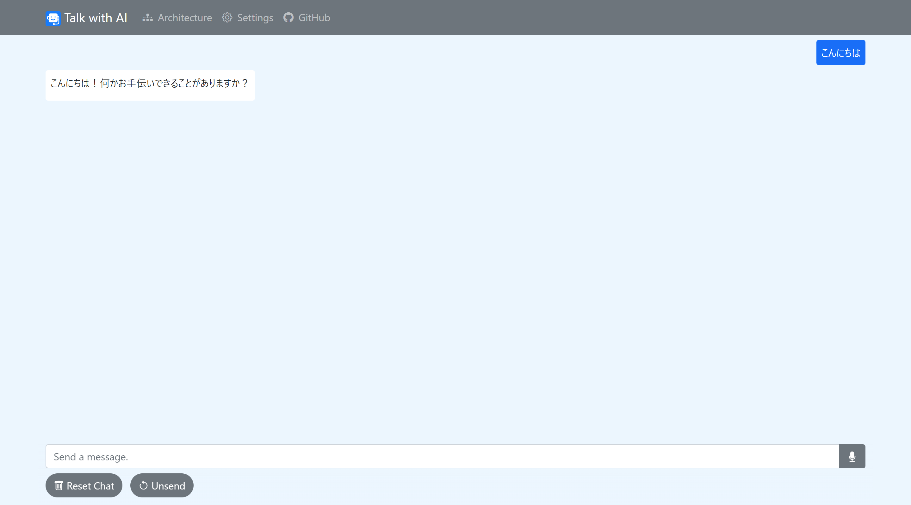
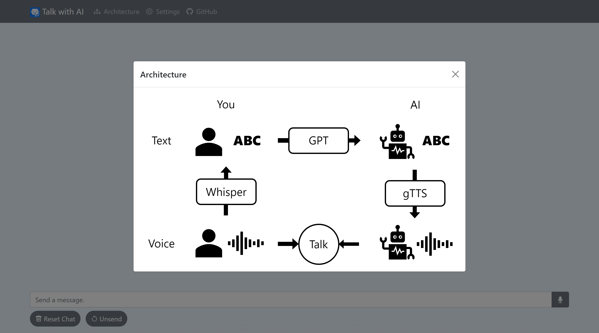
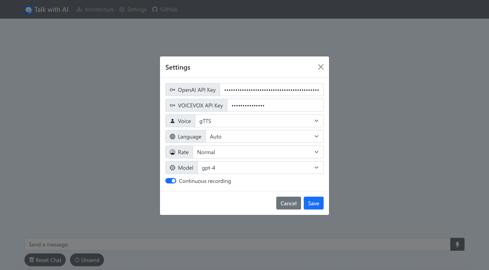

# Talk-with-AI

This is an application for talking with AI. The input voice is converted into text by Whisper, and then that text is used as the basis for GPT to generate a response. That response text is converted into voice through TTS (Text-to-Speech) and outputted. This allows you to have voice-based conversations with AI. 

Furthermore, by using a [voice activity detector (VAD)](https://github.com/ricky0123/vad), recording begins automatically when you start speaking and stops once you finish. This then sends the transcribed text, allowing users to interrupt and start a conversation even if the AI is mid-response.

## Installation
```
git clone https://github.com/AokiKoshiro/talk-with-ai.git
cd talk-with-ai
pip install -r requirements.txt
python app.py
```

## Demo
You can try this app [here](https://talk-with-ai.onrender.com/).

## Screenshots



